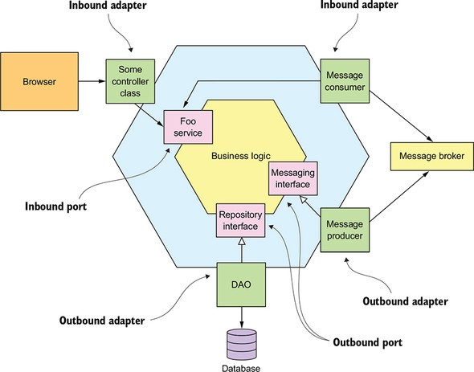

<div align="center">


</div>

<div align="center">

# POC - Ports & Adapters Architecture ou Arquitetura Hexagonal


</div> 

<div align="center">

## Arquitetura



</div>

## Fundamentos teóricos

> Ports & Adapters Architecture ou Arquitetura Hexagonal: A arquitetura hexagonal, ou arquitetura de portas e adaptadores, é um padrão arquitetural usado no design de software. O objetivo é criar componentes de aplicativos fracamente acoplados que possam ser facilmente conectados ao ambiente de software por meio de portas e adaptadores.

> Springboot: O Spring Boot é um projeto da Spring que veio para facilitar o processo de configuração e publicação de nossas aplicações. A intenção é ter o seu projeto rodando o mais rápido possível e sem complicação.

> Java: Java é uma linguagem de programação orientada a objetos desenvolvida na década de 90 por uma equipe de programadores chefiada por James Gosling, na empresa Sun Microsystems. Em 2008 o Java foi adquirido pela empresa Oracle Corporation.


## Tecnologias
- Java 11
- Spring Boot 2.6.3
    - spring-boot-starter-web
    - spring-boot-starter-data-jpa
    - spring-boot-devtools
- Flywaydb
- Lombok
- Mysql
- springdoc-openapi-ui
- Tomcat (Embedded no Spring Boot)
- Git

## Execução

- Scripts
  ### Executar docker-compose
    - 1° comando: ``` cd src/main/docker/```
    - 2° comando: ```docker-compose -f docker-compose.yml up```
  ### Executar a aplicação
    -  ```./mvnw clean compile spring-boot:run```
  ### Executar testes
    -  ```./mvnw clean compile verify sonar:sonar```

# Utilização

## Swagger
http://localhost:8080/ms-person/swagger-ui/index.html?configUrl=/ms-person/api-docs
